# Тестирование мультимодема Sistematics

## Этапы тестирования

1. [Условия тестеривания](#условия-тестирования)
2. [Тестирование в режиме агрегации](#режим-агрегации) \
   2.1. [Тестирование скорости iperf3](#тестирование-скорости-iperf3) \
   2.2. [Тестирование канала агрегации скриптом](#агрегация)  
   2.3. [Маршрутизация при потере одно из каналов](#потеря-канала) \
   2.4. [Потеря наземного канала](#потеря-наземного-канала) \
   2.5. [Тест загрузки процессора](#тест-загрузки-процессора) \
   2.6. [IP адресация](#ip-адресация) 
3. [Итоги тестирования](#итоги-тестирования)
4. [Возможные варианты использования](#варианты-использования)

## Условия тестирования

Мульти модемом (далее ММ) расположен на столе в центре офиса, в трех метрах от окна. В тестировании участвуют четыре симкарты операторов МТС, Билайн, Мегафон, Теле2. Назеиный канал от Сибирских Сетей 100Мб, DHCP. 
- Средние значения уровня сигнала

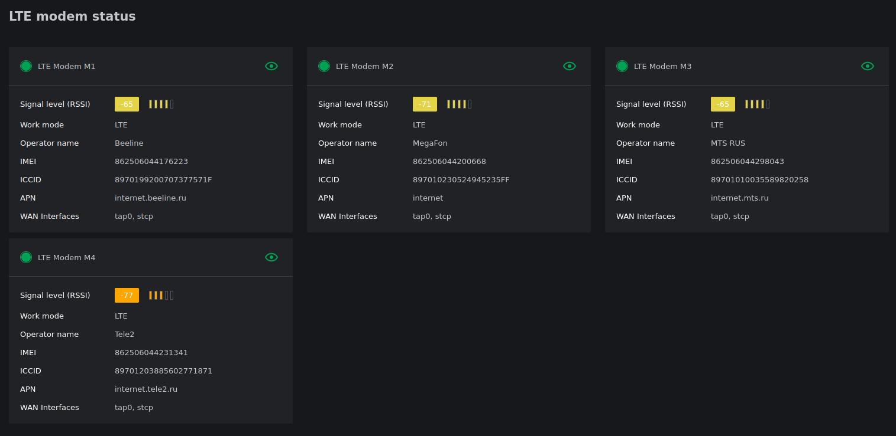

Характеристики наземного канала

- Тест скорости наземного канала

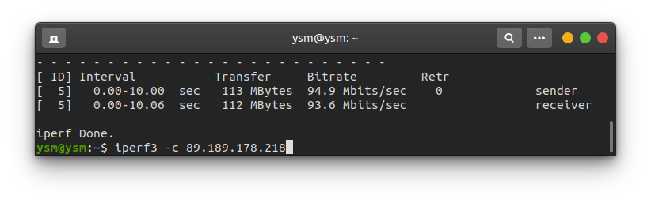

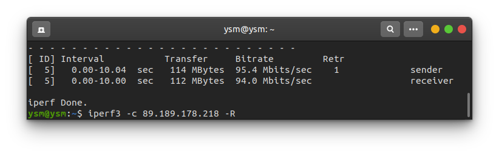

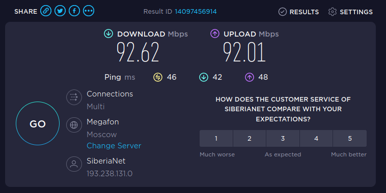

## Режим агрегации
### Тестирование скорости iperf3

Тестирование проводилось утилитой iperf3. Измеряли пропускную способность канала между ММ и удаленным сервером (далее СРВ) с пропускной способностью 100Мб. 

**== UPload ==**

- TCP тест upload 1 поток
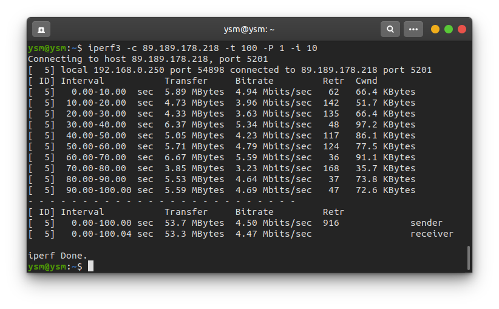

- TCP тест upload 16 потоков
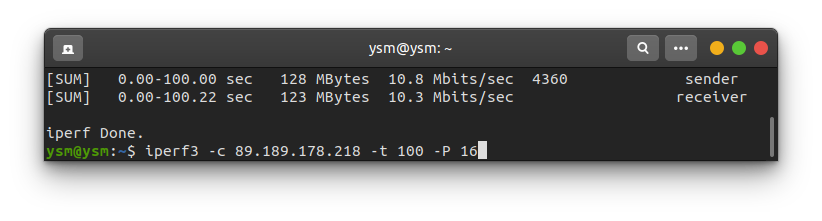

- TCP тест upload 40 потоков
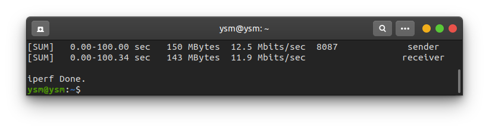

- UDP тест upload 1 поток 100Мб

- UDP тест upload 16 потоков 100Мб

- UDP тест upload 40 потоков 100Мб
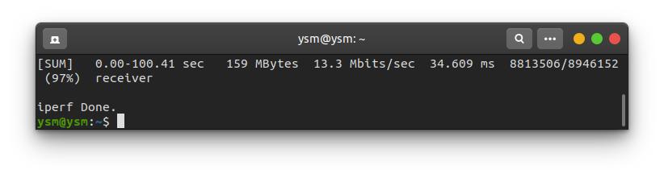

**== Download ==**

- TCP тест Download 1 поток
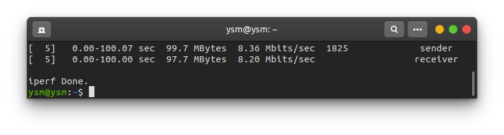

- TCP тест Download 16 потоков

- TCP тест Download 40 потоков
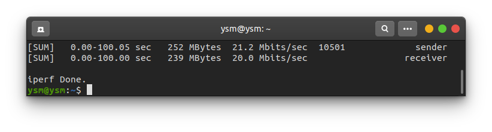

- UDP тест Download 1 поток 100Мб
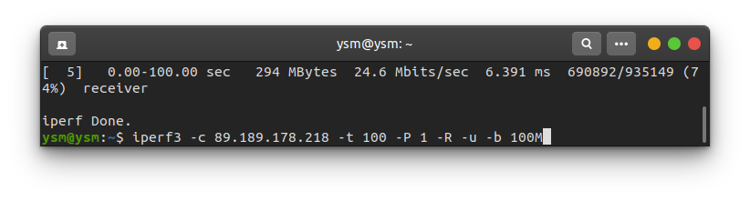

- UDP тест Download 16 потоков 100Мб

- UDP тест Download 40 потоков 100Мб

**== Вывод ==**

При использовании многопоточной передачи данных скорость возрастает в связи с распределением трафика на все симкарты. Прирост скорости:
- TCP upload прирост ~ 150%
- UDP upload прирост ~ 60%
- TCP download прирост ~ 140%
- UDP download прирост ~ -5%

### Потеря канала

Провели тестирование работоспособности при потере сигнала от сим-карт. При нескольких запущенных потоках udp, при потере сигнала от одной или нескольких сим-карт перестроение маршрутов происходит мнгновенно. При потере сигнала от всех сим-карт и их подключении обратно, связь восстанавливается в течении нескольких секунд.

### Агрегация

Тестируем скриптом предоставленным Sisitematiks. В нем проведена замена сервера iperf на наш сервер. Скрип тестирует скорость до сервера отдельно через каждый модем и через агрегированный канал. Выводит информацию о процентной разнице между матиматической суммой скорости через модемы и агрегированным каналом.

- TCP тест Download тест iperf.

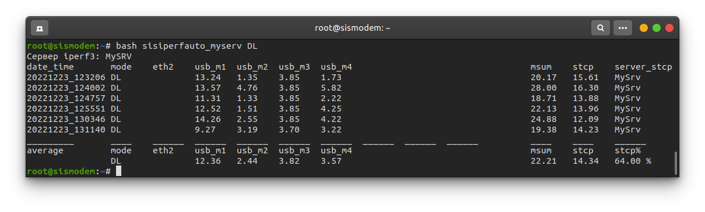

- TCP тест Upload тест iperf.

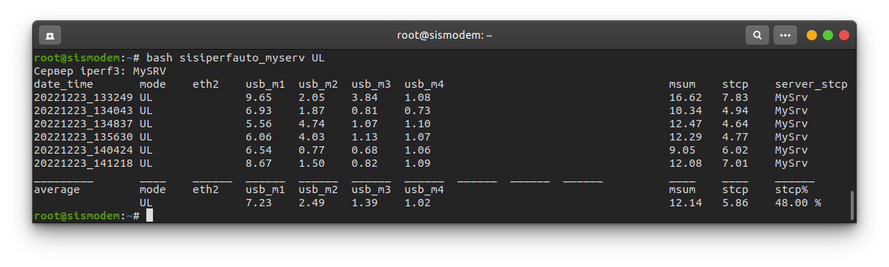

Спустя несколько дней...

- TCP тест Download тест iperf.

- TCP тест Upload тест iperf.

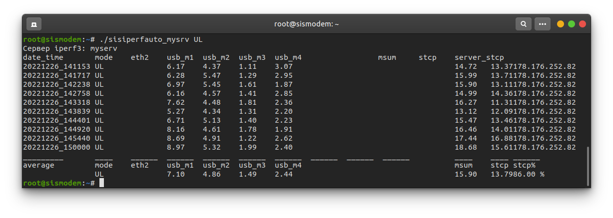

**== Вывод ==**

При тестирование входящего канала виден небольшой прирост скорости и что агрегация работает хоть и не совсем так как математически возможно. При тестирование исходящего канала прирост замечен не был, наоборот скорость агрегированого канала оказалось ниже чем способен предоставить отдельно один модем.
При повторном тестировании, через несколько дней, бвло выявлено значительное улучшение работы канала агрегации. Он начал работать практически в соответствии с математическим значением.  

### Потеря наземного канала

В этом разделе тестируем поведение ММ при потере наземного канала.

При первичном тестирование обнаружили что после восстановления наземного линка маршруты не перестравались на него до перезагрузки роутера. О чем было сообщено инженерам систематикаса. От них получили ответ:

\> *Добрый день!
Если статику прописать всё будет работать.
Я кажется понимаю в чем бага.
У вас на свиче же включен STP?
 Думаю порт переходит в состояние Forwarding уже после того как от MM отправляет 3 request DHCP, а у нас получает потому, что порт на свиче включен сразу.
Не выключайте пока ММ пожалуйста, мы на нем протестируем🙂*

После проведения работ инженерами систематикс возобнавили тестирование потери наземного канала.

- Замерим скорость при подключенном наземном канале (downlink, uplink).

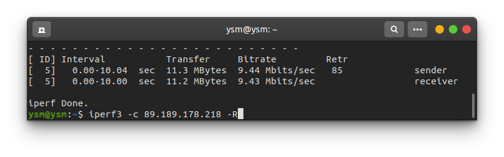
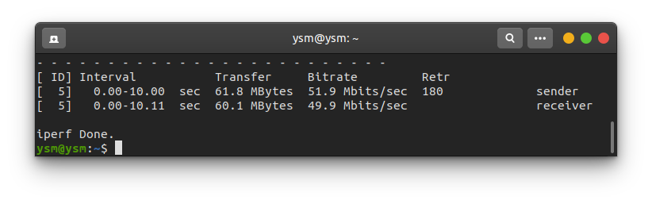

Потеря скорости подтверждается спидтестом.

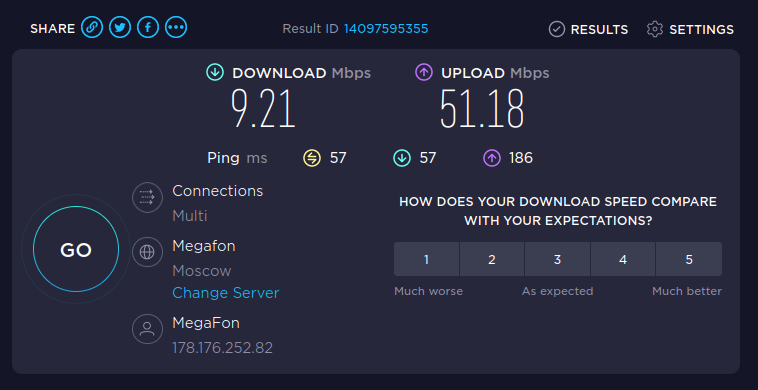

Инженеры были проинформированы про потерю скорости при работе через наземный канал.

- Запустили тест iperf3 до СРВ, на 21 секунде отключаем наземный канал

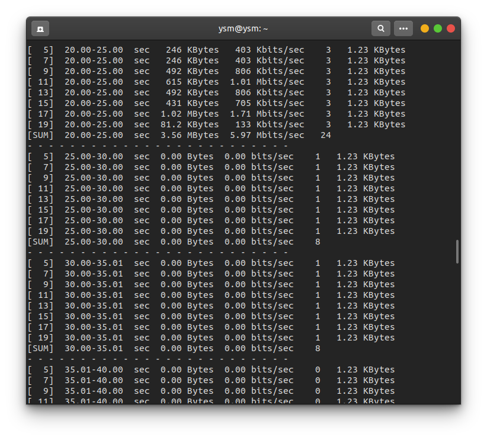

- На 75 секунде ММ переключился на работу через Симкарты 

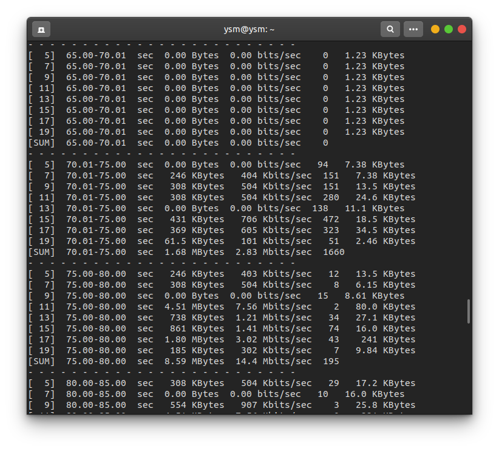

- На 95 вернули наземный канал, на 125 трафик пошел через него  

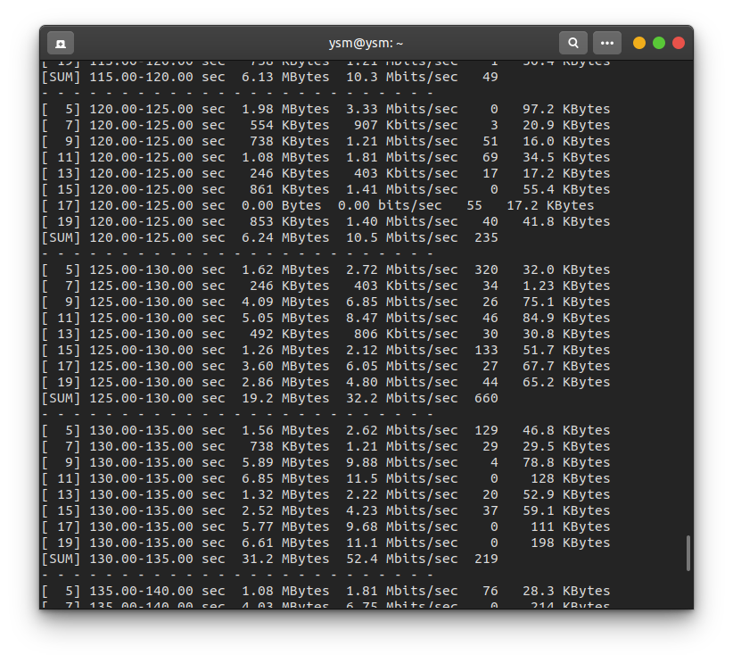

**== Вывод ==**

На переключение с наземного канала на резервный (4G) ММ потребовалось около 50 секунд. На переключение обратно на наземный канал 30 секунд.

### Тест загрузки процессора

Провели тестирование загрузки процессора. При одновременном запуске разного количества потоков получены следующие результаты : 
 - 128 потоков
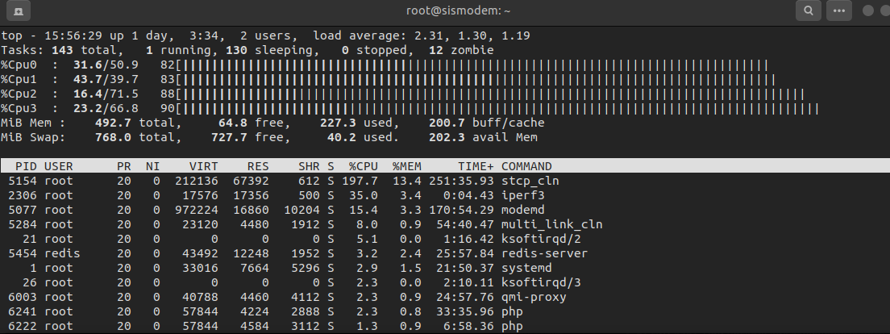
 - 64 потоков
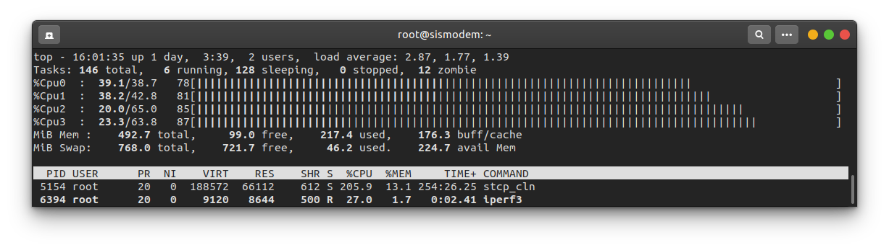
 - 32 потока
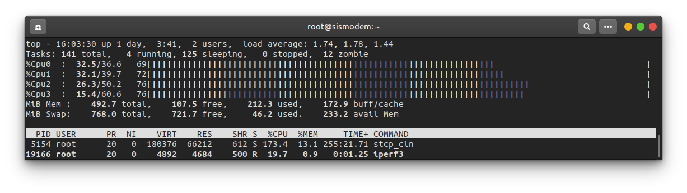
 - 16 потоков

 - 8 потоков
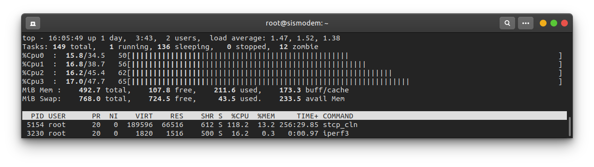
 - 1 поток
 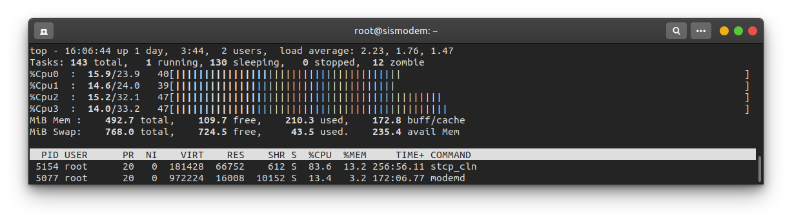
 - В простое
 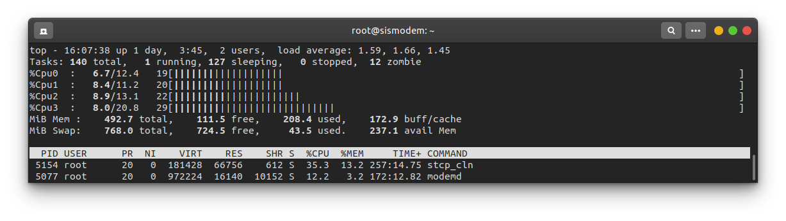

 **== Вывод ==**

 С обработкой большого количества потоков устройство справляется нормально.

### IP адресация

Внешний ip адрес устройства оставался неизмнным при отключение и подключении обратно разных операторов связи. Устройство выходит во внешнюю сеть через белый айпи адрес сервера агрегации систематикс. Так как в режиме агрегации поднят туняль до сервера агрегации.

 - Информация с 2IP
 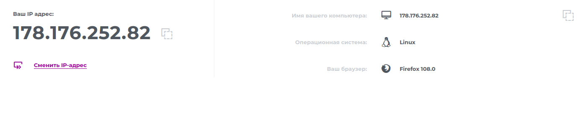
 - Traceroute яндекса
 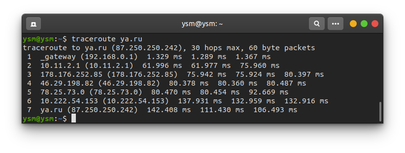

 ## Итоги тестирования

 В качестве устройства для резервирования наземного канала использование не рекомендуется, ввиду долгого (в районе 30с) переключения при падении канала, а также наличии ограничения скорости наземного канала до 10мб\с в следствии ошибки в прошивке устройства.
 В качестве устройства для агрегации трафика с нескольких сим-карт использование данного устройства выглядит нецелесообразно, ввиду дороговизны данного решения, относительно получаемого результата. Агрегация происходит, но происходит нестабильно, периодически наблюдаются существенные просадки скорости, относительно математической суммы трафика со всех сим-карт.
 В целом, основной техический минус данного решения, нестабильная работа, в следствии "сырой" прошивки и отстутствии адекватного пользовательского интерфейса (сайт для мониторинга тоже очень "сырой").

Плюсом данного устройства является то, что в отличии от обычного модема 4g, оно позволяет работать с VLAN.

Из положительных сторон можно выделить севис производителя, техподдержка в режиме "онлайн" готова помочь с любыми возникающими при эксплуатации проблемами. После исправления техподдержкой систематкса выявленных проблем в работе  устройства режим агрегации начал работать хорошо, канал начал работать на 85% от математически рассчитаного.
 
  ## Варианты использования

   - Экстренное восстановление связи ключевым клиентам, при проблемах с восстановлением основного канала связи.
   - Подключение клиентов в местах где нет техничесокой возможности подклчения через иные каналы связи.
   - Подключение удаленных адресов клиентов в общую локальную/vlan сеть
